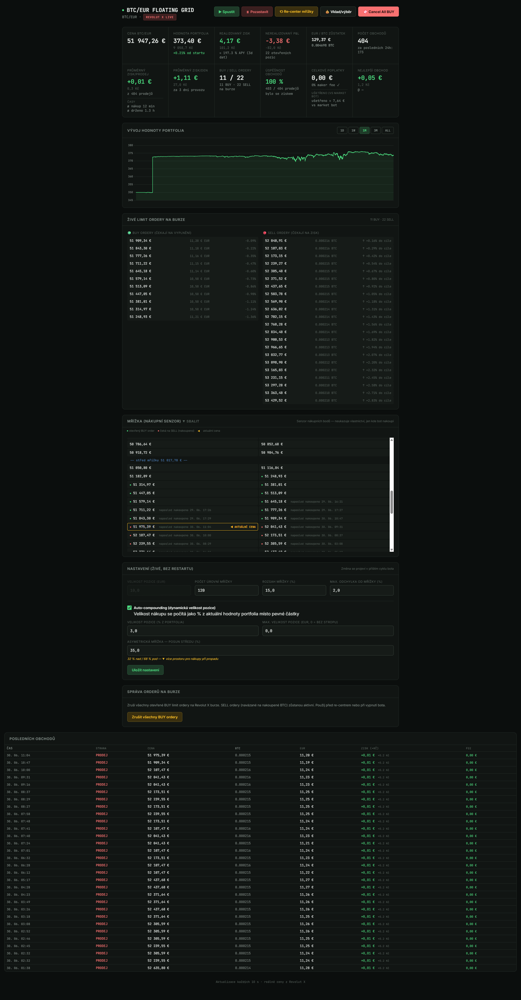

# BTC/EUR Limit Order Grid Bot — Revolut X

[](LICENSE)
[](https://www.python.org/)
[](https://www.docker.com/)

A self-hosted grid trading bot for BTC/EUR on **Revolut X**, using
**GTC limit orders** to achieve **0 % maker fees**. Includes a live
web dashboard built with Flask. Runs as a single Docker container on
any home server, NAS, or VPS.

> ⚠️ **Financial risk disclaimer**: This is an experimental trading
> tool. Cryptocurrency trading can result in the loss of your entire
> capital. Always start in `DRY_RUN=true` (paper trading) mode and
> only risk funds you can afford to lose. See [LICENSE](LICENSE) for
> the full disclaimer.

> > 🌍 **Language note**: The dashboard UI and bot logs are currently in
> **Czech**. This README is in English so the project is discoverable
> and usable internationally, but full i18n support (English UI
> toggle) is not actively planned — might happen eventually, might
> not. PRs adding an English (or any other) UI translation are very
> welcome.

---

## Why limit orders instead of market orders?

Most simple grid bots use market orders — easy to implement, but they
cost a taker fee on every single trade (0.09 % on Revolut X). That fee
eats directly into your grid's edge: a market-order bot needs a step
size *larger* than ~0.18 % round-trip just to break even.

This bot places **GTC (Good-Till-Cancelled) limit orders** directly on
the exchange order book instead. Revolut X charges **0 % for maker
orders**, so:

- the entire grid step is pure profit (no fee to subtract)
- you can run a *much* tighter grid (more levels, smaller steps) without
  the fee eating your edge
- order fills happen exactly at your target price — no slippage

The trade-off: the bot's logic is reactive to *fills*, not to price
polling. It synchronizes with the exchange's order book every cycle
to detect what filled since the last check.

## How the grid works

1. On startup (or re-center), the bot builds an asymmetric price grid
   around the current market price (`GRID_BIAS_PERCENT` controls how
   much of the grid sits below vs. above the current price — more
   room below means more buy levels to catch dips).
2. It places BUY limit orders on as many grid levels below the current
   price as the available capital allows ("sliding window" — see below).
3. When a BUY order fills, the bot immediately places a matching SELL
   limit order one grid step above the fill price.
4. When that SELL fills, the round trip is recorded as a completed,
   profitable trade (0 % fee, full step = profit).

### Sliding window / capital recycling

With a finite EUR balance, the bot can't keep buy orders open on every
single grid level simultaneously. Instead, it keeps the **closest N
levels to the current price** filled with live orders (where N is
however many your capital allows), and automatically cancels +
re-places the lowest, least-likely-to-fill order when the price moves
and a closer level needs capital. This maximizes the chance that your
limited capital is always working near the action.

### Why re-centering is always manual

If the price trends strongly in one direction, the grid eventually
drifts outside its useful range relative to the price
(`MAX_PRICE_DEVIATION_PERCENT`). The bot then **pauses itself** and
waits for you to click "Re-center grid" in the dashboard — it never
re-centers automatically. Auto re-centering downward in a falling
market would effectively turn the bot into an uncontrolled DCA buyer
with no human checkpoint, which defeats the purpose of a grid
strategy's risk containment.

Open SELL positions are never affected by a pause or re-center — they
keep waiting for their original target price independently of where
the grid currently sits.

## Features

- 0 % maker fee trading via GTC limit orders on Revolut X
- Asymmetric grid bias (more buy levels below price than above)
- Sliding window capital recycling
- Live web dashboard (price chart, open orders, trade history, win
  rate, APY estimate, EUR + local currency display)
- Paper trading mode (`DRY_RUN=true`) with realistic order-fill
  simulation — test for free before risking real capital
- Telegram notifications (trades, pauses, daily summary)
- Runtime-adjustable settings (position size, grid range, bias,
  compounding) — no restart needed
- Ed25519 API authentication (Revolut X's signing scheme)

## Quick start (Docker Compose)

```bash
git clone https://github.com/<your-username>/btc-limit-bot.git
cd btc-limit-bot
cp .env.example .env
# edit .env if you want to change defaults — the bot works out of the
# box in paper trading mode with no API keys needed
docker compose up -d --build
```

Dashboard: `http://<server-ip>:5051` (default port, change via
`FLASK_PORT` in `.env`).

The default `.env.example` ships with `DRY_RUN=true` — the bot starts
in paper trading mode immediately, simulating fills against live
Revolut X order book prices with no real money involved.

## Going live

Revolut X authenticates API requests with an **Ed25519 key pair**, not
a classic API secret.

1. Generate a key pair:
   ```bash
   docker exec -it btc-limit-bot python generate_revolutx_keys.py
   ```
2. Copy the printed **public** key into the Revolut X app
   (Profile → API Keys → Add new key).
3. Revolut X will issue an **API Key** — paste it into `.env` as
   `REVOLUTX_API_KEY`.
4. Set `DRY_RUN=false` in `.env`.
5. Restart: `docker compose up -d --build`

**Strongly recommended**: run in paper trading mode for at least a
few days first, and when going live, start with a small grid (few
levels, small order size) to confirm everything behaves as expected
before scaling up capital.

## Configuration reference

All settings live in `.env` (see [`.env.example`](.env.example) for
the full annotated list). Key ones:

| Variable | Description |
|---|---|
| `DRY_RUN` | `true` = paper trading, `false` = live orders on Revolut X |
| `GRID_LEVELS` | Number of price levels in the grid |
| `GRID_RANGE_PERCENT` | Total grid width around current price (%) |
| `GRID_BIAS_PERCENT` | Asymmetry — higher = more levels below price |
| `ORDER_SIZE_EUR` | Fixed EUR size per order (used if compounding is off) |
| `MAX_PRICE_DEVIATION_PERCENT` | Pause threshold when price exits the grid |
| `POLL_INTERVAL_SECONDS` | How often the bot syncs with the exchange |

Several of these (position size, grid range/bias, auto-compounding)
can also be changed live from the dashboard's Settings panel without
a restart — changes apply on the next cycle.

## Auto-compounding

Instead of a fixed `ORDER_SIZE_EUR` per trade, you can enable
**Auto-compounding** in the dashboard: order size becomes a percentage
of your *current total portfolio value* (EUR balance + BTC holdings at
market price). As your capital grows — from profits or manual
deposits — position sizes scale up automatically without touching
settings. An optional cap (`max_position_eur`) limits any single
position regardless of portfolio percentage.

## Deposits and withdrawals

The bot does not automatically sync with your real Revolut X balance
(by design — if you also trade manually on the same account, an
automatic sync could cause the bot to sell positions you bought
yourself). After depositing or withdrawing funds on the exchange:

1. Click **Deposit/Withdraw** in the dashboard.
2. Enter the amount (positive = deposit, negative = withdrawal).
3. The bot's internal EUR balance updates immediately, no restart
   needed. Profit/loss percentage calculations automatically account
   for the adjustment so a deposit doesn't appear as a sudden gain.

## Telegram notifications (optional)

Set these in `.env`:

- `TELEGRAM_NOTIFY_TRADES` — every buy/sell fill
- `TELEGRAM_NOTIFY_PAUSE` — bot paused (grid out of range)
- `TELEGRAM_NOTIFY_DAILY_SUMMARY` — daily performance recap
- `TELEGRAM_DAILY_SUMMARY_TIME` — what time to send it (HH:MM)
- `TELEGRAM_PAUSE_REMINDER_MINUTES` — repeat-reminder interval while
  paused (0 = disabled)

To set up: create a bot via [@BotFather](https://t.me/BotFather) on
Telegram, then find your chat ID via
`https://api.telegram.org/bot<TOKEN>/getUpdates` after sending the bot
a message.

## Dashboard overview



- **Live price, portfolio value, realized/unrealized P&L**, displayed
  in EUR with a secondary local-currency conversion
- **Open orders panel** — separate BUY (waiting to fill) and SELL
  (waiting for profit target) lists, with distance-to-fill percentage
- **Grid visualization** — collapsible price ladder showing which
  levels have active orders and when they last triggered
- **Trade history** — full log with price, size, profit, and 0 % fee
  confirmation
- **Settings panel** — live-editable grid and position parameters
- **Manual controls** — Start/Pause, Re-center grid, Cancel all BUY
  orders, Deposit/Withdraw

## Project structure

```
btc-limit-bot/
├── app.py                      # Flask web server + dashboard API
├── config.py                   # Environment variable loading
├── bot/
│   ├── runner.py                # Main trading loop, sliding window logic
│   ├── database.py               # SQLite schema and queries
│   ├── grid_engine.py            # Grid price level generation
│   ├── revolutx_client.py        # Revolut X API client (Ed25519 auth)
│   └── telegram_notify.py        # Telegram notification helpers
├── templates/
│   └── dashboard.html           # Single-page dashboard UI
├── generate_revolutx_keys.py    # One-time Ed25519 key pair generator
├── docker-compose.yml
├── Dockerfile
└── .env.example
```

## Database schema (overview)

SQLite, stored at `data/bot.db` (persisted via Docker volume):

- `wallet` — current EUR/BTC balance (local mirror, not live-synced
  with the exchange)
- `settings` — runtime-adjustable parameters (key → value)
- `grid_levels` — current grid price levels
- `exchange_orders` — all BUY/SELL limit orders placed on the
  exchange, their fill status
- `trades` — completed buy→sell round trips with realized profit
- `equity_snapshots` — portfolio value over time (for the dashboard
  chart)
- `cash_adjustments` — manual deposit/withdrawal history

## Safety mechanisms

- Default mode is always paper trading — live orders require explicit
  `DRY_RUN=false` and valid API credentials
- Bot pauses itself if price exits the configured grid range
- Grid re-centering is always manual, never automatic
- Capital recycling logic never over-commits beyond the wallet balance
- Private Ed25519 key is generated and stored only locally on your
  server, never transmitted anywhere except to Revolut X during
  signing

## Contributing

Issues and pull requests welcome. This started as a personal project
adapted for public release — if you spot something Revolut-X-API or
exchange-specific that's brittle, please open an issue.

## Support this project

If this bot is making (or saving) you money and you'd like to say
thanks:

- **Revolut**: [revolut.me/mikyner](https://revolut.me/mikyner)
- **Bitcoin**: `bc1q6rv0hc6yy4pausw6ql5mwl75g7ljzdlpc2hawx`

And if you don't have a Revolut account yet, signing up with my
referral link costs you nothing extra and helps support this project:
[revolut.com/referral](https://revolut.com/referral/?referral-code=janmica1d!JUL1-26-AR-RPB&geo-redirect)

## License

MIT — see [LICENSE](LICENSE). Includes a financial risk disclaimer;
please read it before using this with real funds.
